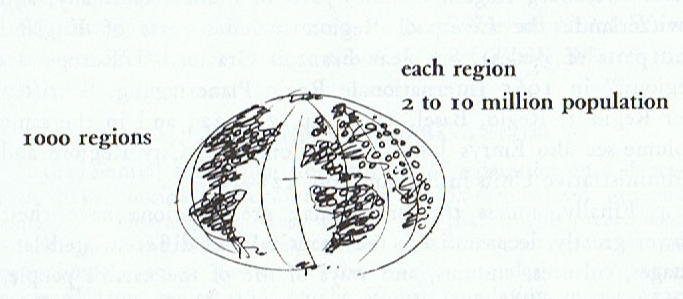
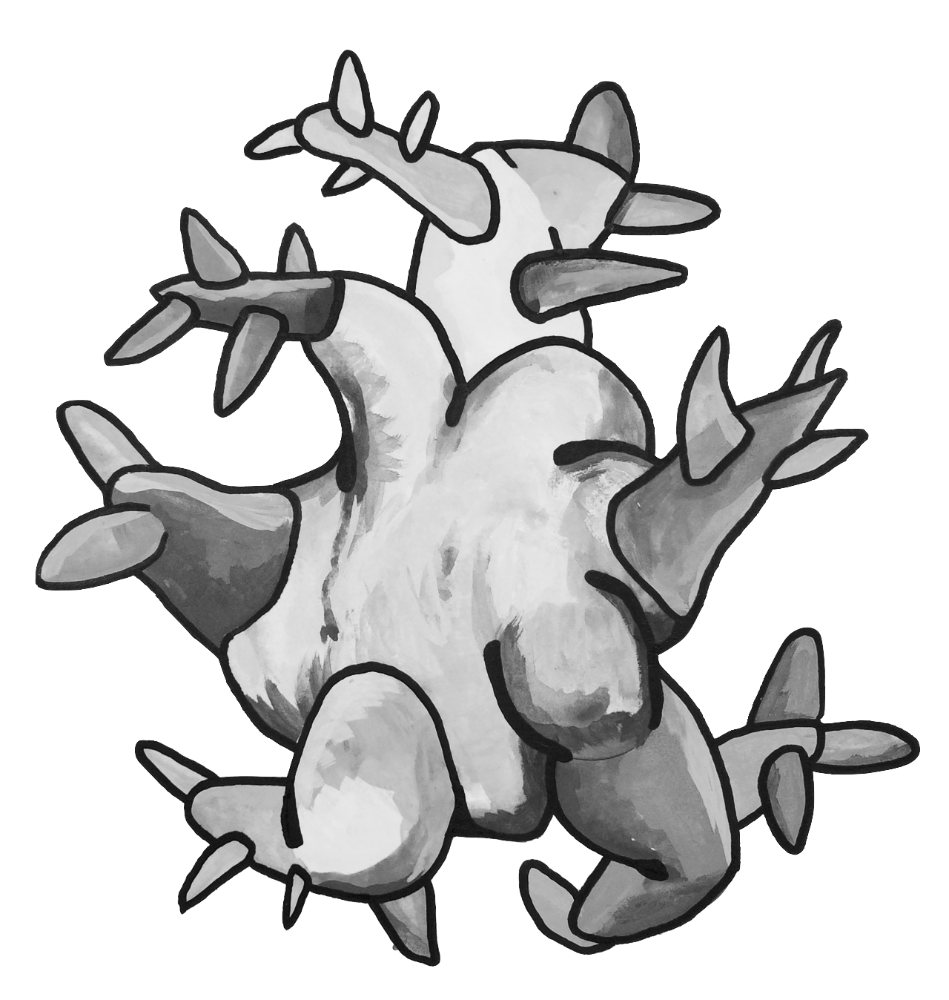
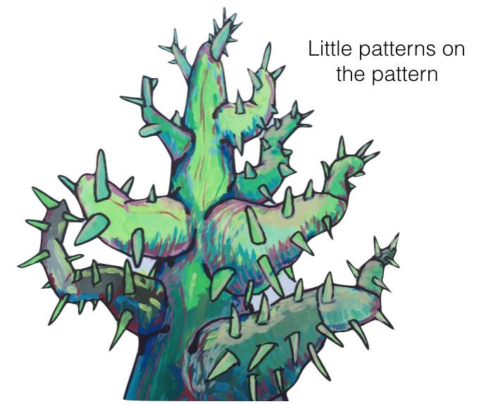

<!--Chapter name describing over big pattern-->
# ANOTHER BIG PATTERN {-}

<!--Opening abstract of general pattern-->
*We begin with pointing out a coherent overview of the pattern we are trying to describe. This global pattern contains several constituent patterns. This is the big idea right here.*


<center>
&#10070; &#10070; &#10070;
<br><br></center>

<!--Extended description of this family of patterns-->
This is the part where we write for a couple paragraphs or pages, giving some background on this pattern we have identified. We describe the big pattern, and talk about the smaller constituent patterns that make up the bigger pattern. This is a kind of larger roadmap, along with some suggestions for using the smaller patterns, it's an overview and organizing framework with suggestions for thinking using the pattern language for this section.

<!-- line breaks for white space -->
<br><br><br><br><br><br><br><br>

<!---------END BIG PATTERN OVERVIEW-------------->


<!----BEGIN SUB PATTERN SECTION-->

<!---------BEGIN SUB PATTERN-------------->


<!-- Useful statement about the sub pattern -->
*A short useful statement summarizing the heart of this next pattern, and what it does and connects to;*

<!-- List of next patterns in sub-pattern section -->
<div class="suggest"><p>
1\. THIS PATTERN  <br>
2\. THAT PATTERN  <br>
</p></div>

<!-- line breaks for white space -->
<br><br><br><br><br><br><br><br>

<!-- Individual Pattern heading -->
## THIS PATTERN {-}

<!-- nice picture for pattern -->
```{r, echo=FALSE, fig.align='center'}

```

<!-- Short statement of pattern -->
**The things will be this way or that way, says this pattern**

<!-- Justification of pattern -->

As many paragraphs as you need to justify and explain the pattern and it's uses.

<!-- Implication for use of pattern -->
Therefore:

**Wherever possible, do this thing to use the pattern, so it contributes to the whole pattern**

<br><br>

<!-- Implication for use of picture -->
```{r, echo=FALSE, fig.align='center'}

```

<!-- Three diamonds and spacing -->
<br><center>
&#10070; &#10070; &#10070;
<br><br></center>

<!-- reiterate usage statement with connection to next pattern -->
Remember, do this thing, as it feeds into --THAT PATTERN...

<br><br>

<!---------END SUB PATTERN-------------->


<!---------BEGIN SUB PATTERN-------------->

<!-- line breaks for white space -->
<br><br><br><br><br><br><br><br>


<!-- Individual Pattern heading -->
## THAT PATTERN  {-}

<!-- nice picture for pattern -->
```{r, echo=FALSE, fig.align='center'}

```

<!-- Short statement of pattern -->
**The things will be this way or that way, says this pattern**

<!-- Justification of pattern -->

As many paragraphs as you need to justify and explain the pattern and it's uses.

<!-- Implication for use of pattern -->
Therefore:

**Wherever possible, do this thing to use the pattern, so it contributes to the whole pattern**

<br><br>

<!-- Implication for use of picture -->
```{r, echo=FALSE, fig.align='center'}

```

<!-- Three diamonds and spacing -->
<br><center>
&#10070; &#10070; &#10070;
<br><br></center>

<!-- reiterate usage statement with connection to next pattern -->
Remember, do this thing, as it feeds into --THE NEXT PATTERN...

<br><br>

<!---------END SUB PATTERN-------------->

<!----END SUB PATTERN SECTION-->


